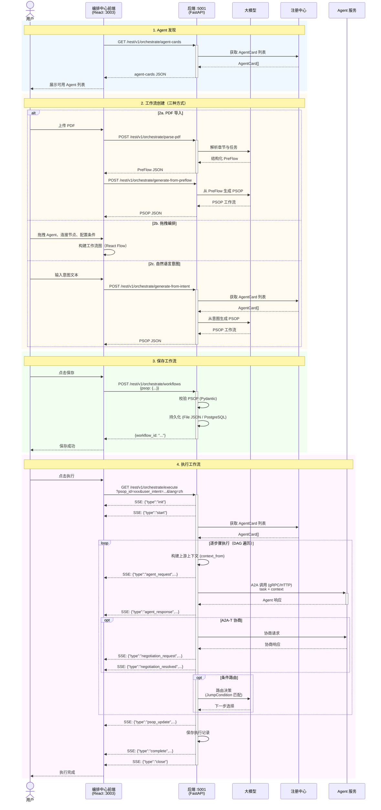

<!--
Copyright (c) 2026 Huawei Technologies Co., Ltd.
All Rights Reserved.

SPDX-License-Identifier: Apache-2.0

   Licensed under the Apache License, Version 2.0 (the "License"); you may
   not use this file except in compliance with the License. You may obtain
   a copy of the License at

        http://www.apache.org/licenses/LICENSE-2.0

   Unless required by applicable law or agreed to in writing, software
   distributed under the License is distributed on an "AS IS" BASIS, WITHOUT
   WARRANTIES OR CONDITIONS OF ANY KIND, either express or implied. See the
   License for the specific language governing permissions and limitations
   under the License.
-->

# OpenAN 编排中心 设计文档

*版本: 2.0*

## 1. 系统架构总览



**数据流方向**: 用户意图/PreFlow → PSOP生成 → 存储 → OrchestrationEngine (A2A-T 下发) → 工作台智能体执行 → A2A Agent并行调用 → SSE事件回传 → 执行记录存储

---

## 2. 领域模型设计

### 2.1 核心模型关系

```text
PreFlow (人工SOP模板)
  │  id, name, description, created_at, steps_md (markdown), tags
  │
  ▼
PSOP (可执行工作流)
  │  id, name, description, created_at, steps[], related_preflow, user_intent, tags
  │
  │  Step { name, type: ALL_SUCCESS|ANY_SUCCESS,
  │         layer: int, context_from: ["*"|step_name],
  │         subtasks[Task], next[JumpCondition] }
  │
  │  Task { task_id, description, agent, skill, status }
  │  JumpCondition { step, condition }
  │
  ▼
ExecutionRecord (执行记录)
  execution_id, psop_id, psop_name, started_at, completed_at,
  status (ExecutionStatus Enum), execution_history, final_psop, events, error
```

所有核心模型使用 Pydantic，自动校验与序列化。

### 2.2 分层上下文传播机制

- **Layer 0**: 执行层（叶子Agent），仅依据自身任务描述执行，无上游上下文依赖
- **Layer >= 1**: 聚合层，通过 `context_from` 指定依赖的前驱步骤，接收上游步骤的输出作为上下文中做综合分析
- `context_from: ["*"]` 表示接收所有前驱（含间接）的输出
- 工作台智能体在执行时递归收集前驱输出，粗估截断至 ~6000 tokens

---

## 3. 执行引擎设计

### 3.1 三层架构

```text
Frontend (React :3003)
    │  REST / SSE
    ▼
OrchestrationEngine (编排中心, 薄 A2A-T 分发通道)
    │  A2A-T send_message_stream
    ▼
Workbench Agent (工作台智能体, Leader, 集成 workflow-engine SDK)
    │  A2A Protocol + A2A-T Negotiation
    ▼
Worker Agents (SPN / 其他业务域 Agent)
```

编排中心**不直接执行工作流**。`OrchestrationEngine` 是一个薄的 A2A-T 分发通道，职责为：

1. 接收前端传入的用户意图
2. 通过 A2A-T 协议将意图下发给工作台智能体（Workbench Agent）
3. 流式接收工作台返回的 SDK 事件（从 TaskUpdate metadata 中提取 `__sdk_event__`）
4. 将事件转发为前端 SSE 流

### 3.2 工作台智能体（Workbench Agent）

工作台智能体是工作流执行的宿主，集成 `workflow-engine` SDK，对标 Java 端的 `TransportWorkbenchAgentExecutor` + `WorkbenchOrchestrator`。

执行流程：

```text
1. 接收意图 → LLM 理解/改写（可选）
2. PSOP 检索 → 调编排中心 API 获取匹配的工作流
3. 加载 Agent Cards → 调注册中心获取可用 Agent 列表
4. 扩展预置 → Authorization-T / Notification-T 预下发
5. 创建 ControlPoint → on_task / on_self_task / on_route / on_negotiation
6. execute_psop → workflow-engine SDK 驱动 DAG 遍历
   ├─ ALL_SUCCESS: asyncio.gather 并行执行
   ├─ ANY_SUCCESS: asyncio.as_completed 首个成功即返回
   ├─ 条件路由: LLM 路由决策 (JumpCondition)
   └─ 上下文聚合: 根据 context_from 收集上游输出
7. 事件回流 → SDK 事件编码为 A2A-T TaskUpdate → 编排中心 → 前端 SSE
```

### 3.3 SSE 事件转发机制

工作台智能体将每个 SDK 事件编码为 A2A-T `TaskStatusUpdateEvent`，原始事件 JSON 保留在 `metadata["__sdk_event__"]` 中。编排中心的 `OrchestrationEngine` 从流式响应中提取该字段，原样转发给前端。

前端视角仍为 11 种事件类型（init、start、agent_request、agent_response、psop_update、negotiation_request、negotiation_resolved、negotiation_failed、complete、error、close），但事件产生方已从编排中心迁移至工作台智能体的 workflow-engine SDK。

### 3.4 A2A-T 协商支持

协商逻辑由工作台智能体的 `WorkbenchControlPoint` 驱动，通过 workflow-engine SDK 的 `ControlPoint` 接口实现 `on_negotiation` 回调。不可用时降级为普通 A2A 调用。

---

## 4. 存储层设计

### 4.1 双模存储架构

```text
                   HandlerRegistry
                   ┌─────────────┐
                   │ _registry   │ (class dict)
                   │ get_handler │──── 根据 InterfaceType + persistence_mode 分发
                   └──────┬──────┘
          ┌───────────────┼───────────────┐
      file mode       postgresql mode
  ┌──────┴──────┐  ┌───────┴──────────┐
  │BaseHandler  │  │Custom*Handler    │
  │ 子类8个     │  │ 子类8个          │
  │→WorkflowStorage│→psop_processor   │
  │  (文件JSON) │  │  execution_rec.. │
  └─────────────┘  └──────────────────┘
```

- `persistence_mode=file`（默认）：`WorkflowStorage` 以 JSON 文件存储，使用原子写入（`tempfile + os.replace`）防止文件损坏
- `persistence_mode=postgresql`：经 `HandlerRegistry` 分发到 DB handler，通过 `psycopg2` 直连 PostgreSQL
- 非 file 模式且未注册 handler → 抛出 `ValueError`

### 4.2 操作分发

| 操作 | File 模式 | PostgreSQL 模式 |
|------|-----------|----------------|
| 列出/获取 PSOP | `WorkflowStorage` 直接 | `HandlerRegistry` → DB handler |
| 保存/删除 PSOP | `HandlerRegistry` → file handler | `HandlerRegistry` → DB handler |
| 执行记录 CRUD | `HandlerRegistry` | `HandlerRegistry` |
| PreFlow | `WorkflowStorage` 直接 | 仅 file |

### 4.3 数据库表结构

**psop 表**:

| 列 | 类型 | 约束 |
|-----|------|------|
| `id` | VARCHAR(1024) | PRIMARY KEY |
| `name` | VARCHAR(1024) | NOT NULL |
| `description` | VARCHAR(1024) | — |
| `psop_content` | TEXT | JSON 序列化的完整 PSOP 对象 |

**execution_records 表**:

| 列 | 类型 | 约束 |
|-----|------|------|
| `execution_id` | VARCHAR(64) | PRIMARY KEY |
| `psop_id` | VARCHAR(64) | NOT NULL |
| `psop_name` | VARCHAR(1024) | — |
| `started_at` | TIMESTAMP | — |
| `completed_at` | TIMESTAMP | — |
| `status` | VARCHAR(32) | — |
| `step_count` | INTEGER | DEFAULT 0 |
| `record_content` | TEXT | JSON 序列化的完整 ExecutionRecord |

---

## 5. API 层设计

### 5.1 内部 API (`/rest/v1/orchestrate`)

| 方法 | 路径 | 功能 |
|------|------|------|
| GET | `/workflows` | 列出所有 PSOP |
| GET | `/workflows/{id}` | 获取单个 PSOP |
| POST | `/workflows` | 创建/更新 PSOP |
| DELETE | `/workflows/{id}` | 删除 PSOP |
| POST | `/parse-pdf` | 上传 SolutionPackage PDF 解析 |
| POST | `/generate-from-preflow` | PreFlow + AgentCards → PSOP |
| POST | `/generate-from-intent` | 自然语言意图 → PSOP |
| POST | `/retrieve-by-intent` | 语义检索最佳匹配 PSOP |
| POST | `/retrieve-topn-by-intent` | TopN 语义检索 |
| GET | `/agent-cards` | 列出所有注册的 Agent |
| GET | `/templates` | 列出工作流模板 |
| POST | `/templates/{id}/import` | 加载模板进入编辑器 |
| GET | `/execute` | 执行 PSOP（SSE 流） |
| GET | `/execution-records` | 列出执行记录 |
| GET | `/execution-records/{id}` | 获取单条执行记录 |
| DELETE | `/execution-records/{id}` | 删除执行记录 |

### 5.2 外部 API (`/api/v1`)

| 方法 | 路径 | 功能 |
|------|------|------|
| POST | `/orchestrate/sop` | SOP 编排（JSON 文本或文件上传） |
| POST | `/orchestrate/intent` | 意图编排 |
| POST | `/orchestrate/search` | 按意图搜索工作流 |
| POST | `/orchestrate/execute` | 自动编排 + 执行 SSE |
| GET | `/orchestrate/execute/{id}` | 按 ID 执行 SSE |
| GET | `/orchestrate/psop/{id}` | 获取 PSOP 详情 |
| GET | `/executions` | 列出所有执行记录 |
| GET | `/executions/{id}` | 获取执行结果 |

### 5.3 中间件栈

| 中间件 | 作用 |
|--------|------|
| CORS | 允许所有来源（开发环境） |
| ConnectionLimitMiddleware | 限制并发连接数 |
| TimeoutMiddleware | 请求总超时控制（SSE 端点跳过） |
| logging_middleware | 请求/响应日志 + request UUID |
| security_middleware | URL 长度 + Body 大小检查 |
| RateLimiter | 基于 IP 的每端点速率限制 |

每个 API 端点均配置 `anyio.Semaphore` 并发控制 + `RateLimiter` 速率限制。

### 5.4 Legacy 路由

为保持向后兼容，保留以下路由（已添加 RateLimiter 保护）:

- `GET /agent-cards` → 308 重定向到 `/rest/v1/orchestrate/agent-cards`
- `GET/POST/DELETE /psops/*` → 委托到新路由逻辑

---

## 6. 前端设计

### 6.1 架构

- **框架**: React 18 + Vite + Tailwind CSS
- **流程图**: React Flow (xyflow) 渲染 DAG 工作流
- **国际化**: i18next（zh-CN / en）
- **HTTP**: Axios，120s 超时，response interceptor 自动 unwrap `.data`

### 6.2 三标签页架构

| 标签页 | 组件 | 功能 |
|--------|------|------|
| Agent 注册中心 | `registry_center/` | 浏览已注册 Agent 的详细信息（描述、技能、能力等） |
| 编排中心 | `orchestration_center/` | 三种方式创建工作流：PDF 导入 / 拖拽编排 / AI 生成；模板市场导入；工作流管理（CRUD + 版本发布） |
| 执行中心 | `execution_center/` | 意图检索 → 匹配工作流 → SSE 实时执行 → 事件日志 |

### 6.3 编排中心核心流程

```text
模板点击 → 进入编辑器 → 编辑画布 → 点保存
                                    ↓
                          弹窗输入名称+描述 → 落盘

PDF上传 → 解析章节 → PSOP生成 → 预览 → 可进入编辑

拖拽编排 → 放置Agent → 连线 → 配置属性 → 点保存
                                    ↓
                          弹窗输入名称+描述 → 落盘
```

### 6.4 执行中心核心流程

```text
输入意图 → 检索匹配 → [单选: 直接预览] / [多选: 弹窗选择]
                         ↓
                   点击播放 → SSE 流式执行
                         ↓
             左侧事件日志 / 中间实时工作流状态 / 可查看历史记录
```

---

## 7. 配置系统

### 7.1 配置文件

```text
etc/conf/server.conf       (基础配置, key=value 行)
etc/conf/server.properties (覆盖配置, 更高优先级, 持久化用户设置)
etc/conf/db_config.json    (PostgreSQL 连接)
common/config/llm_config.json   (LLM 提供商配置)
```

### 7.2 关键配置项

| Key | 说明 | 默认值                     |
|-----|------|-------------------------|
| `persistence_mode` | 存储模式: `file` 或 `postgresql` | `file`                  |
| `ip` / `port` | 绑定的 IP 和端口 | `127.0.0.1` / `5001`   |
| `agent_registry_url` | Agent 注册中心地址 | `http://127.0.0.1:5000` |
| `enable_https` | 是否启用 HTTPS | `false`                 |
| `forwarded_allow_ips` | 反向代理信任的 IP | `"127.0.0.1"`           |

### 7.3 设计要点

- `get_conf()` 使用 `@lru_cache(maxsize=1)` 缓存，首次读取后常驻内存
- 所有 key 自动小写化，值均为字符串（使用时需类型转换）
- `#` 开头的行作为注释忽略
- `server.properties` 中的 key 会覆盖 `server.conf`
- DB 配置采用 lazy init：`_ensure_conn_info()` 延迟到首次数据库调用时加载

---

## 8. 关键设计决策

1. **分层上下文传播**（`layer` + `context_from`）——Layer 0 步骤独立执行，Layer >= 1 步骤通过 `context_from` 声明依赖的前驱步骤，工作台智能体自动收集上游输出注入为上下文。`context_from: ["*"]` 表示接收所有前驱（含间接）输出。
2. **插件式存储**（`HandlerRegistry`）——通过 `InterfaceType` 枚举 + `persistence_mode` 配置分发操作到 file 或 PostgreSQL handler，新增存储后端实现 handler 接口并注册即可。
3. **PSOP DAG 模型**——`Step` 包含 `subtasks`（并行任务列表）、`type`（`ALL_SUCCESS` / `ANY_SUCCESS` 执行模式）、`next`（条件跳转列表）。`JumpCondition` 支持声明式转发和 LLM 动态路由两种方式。
4. **SSE 流式推送**——工作台智能体通过 workflow-engine SDK 产出事件，编码为 A2A-T TaskUpdate metadata；OrchestrationEngine 从流式响应中提取 `__sdk_event__` 并 yield 为 `text/event-stream`。执行记录保存完整 `events` 数组，支持事后回放。
5. **Prompt 工程**——PSOP 生成、意图检索、LLM 路由决策均使用结构化 JSON schema 约束输出格式，配合 few-shot 示例减少自由格式偏差。
6. **原子写入**——文件持久化使用 `tempfile.mkstemp` + `os.replace` 确保写入过程不产生半写文件。
7. **全链路 async**——Subtask 在工作台智能体中通过 `asyncio.gather` / `asyncio.as_completed` 并行执行，LLM 调用通过 `run_in_executor` 包装避免阻塞事件循环。
8. **多层防护**——每个 API 端点配置 `anyio.Semaphore` 并发上限 + `RateLimiter` 按 IP 速率限制。
